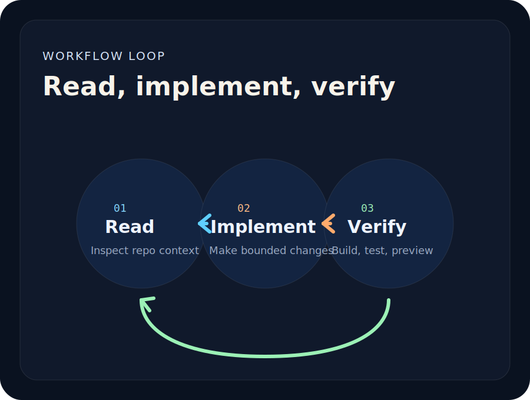
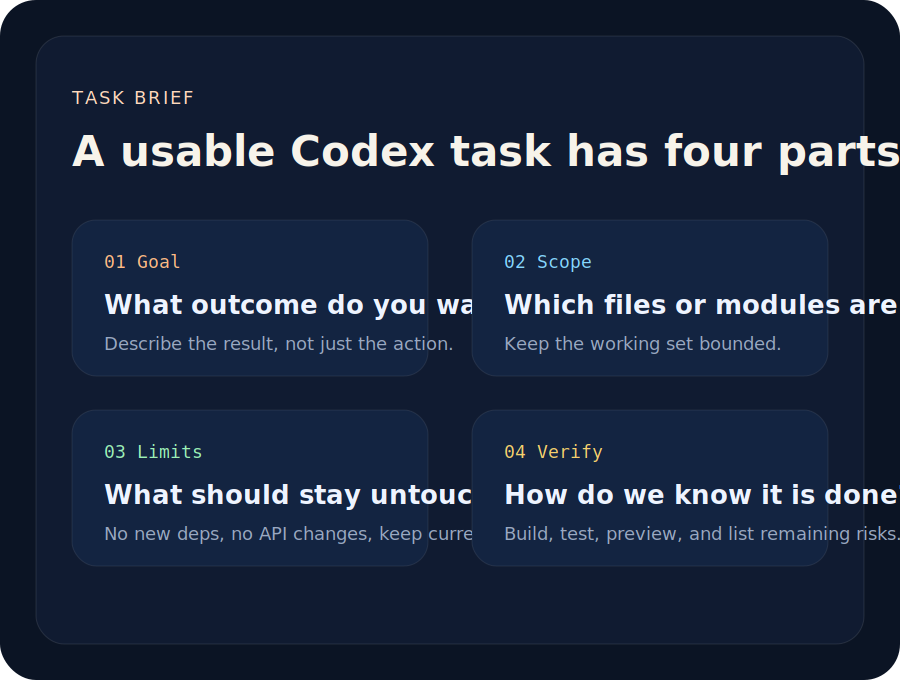

<div align="center">

# Learn Codex

面向中文用户的 Codex 学习与实践教程站。

从认识 Codex、安装桌面 App、跑通第一个任务，到配置扩展、项目实战、调试审查和长期协作，把零散经验整理成一条可以照着走的学习路径。

[](https://nextjs.org/)
[](https://www.typescriptlang.org/)
[](https://tailwindcss.com/)
[](#声明)

[教程目录](#你会在这里看到什么) · [阅读路径](#推荐阅读路径) · [本地预览](#本地预览) · [参与贡献](#参与贡献) · [致谢](#致谢与来源) · [赞助商](#赞助商)

</div>


## 这是什么

Learn Codex 不是一份简单的命令速查表，而是一个围绕真实任务整理的中文内容站。

Codex 的价值不只是“帮你写代码”，而是把需求拆成可执行任务：读取项目、修改文件、运行命令、检查页面、总结结果，并形成可复用的工作流。

这个项目关注三个问题：

| 问题 | 说明 |
| --- | --- |
| 怎么开始 | 新手应该从哪里进入，如何安装、登录、选择项目，并完成第一个低风险任务 |
| 怎么配置 | 什么时候需要调整模型、权限、插件、MCP、自动化和 API 相关配置 |
| 怎么落地 | 如何把 Codex 用在真实项目里，包括写代码、排错、审查、构建、部署和复盘 |

## 项目预览

| 配置地图 | 最小路线 |
| --- | --- |
|  |  |

| 工作流 | 任务拆解 |
| --- | --- |
|  |  |

## 适合谁

- **第一次接触 Codex 的新手**：按顺序了解 Codex 是什么、怎么安装、怎么跑通第一条工作流。
- **想把 Codex 用进项目的开发者**：学习如何下任务、限制范围、验证结果，并在 Next.js 等真实项目中协作。
- **需要配置和扩展能力的用户**：理解模型、权限、插件、浏览器、MCP、API 配置和历史同步等主题。
- **内容创作者和教程整理者**：参考站点结构，把复杂工具说明整理成小白能读懂的中文教程。
- **想参与共建的人**：提交案例、选题、踩坑记录、截图教程或工具推荐。

## 你会在这里看到什么

| 内容 | 说明 |
| --- | --- |
| 入门教程 | Codex 是什么、安装桌面 App、第一次使用、从 0 到 1 上手 |
| 配置专题 | 配置与扩展总览、API 配置、历史同步和常见卡点 |
| 命令与提示词 | 常用交互命令、Slash Commands、如何给 Codex 下任务 |
| 项目实战 | 在 Next.js 项目中使用 Codex、从零搭建教程站 |
| 工作流方法 | 调试、代码审查、最佳实践、返工率控制 |
| 常见问题 | 常见错误、失败原因和排查方向 |
| 热门项目 | Codex 相关仓库、工具、生态项目和延伸阅读 |

## 推荐阅读路径

### 1. 第一次上手

先读：

- Codex 是什么，适合哪些开发者使用
- Codex 桌面 App 图文安装教程
- Codex App 从 0 到 1 完整入门教程
- 第一次使用 Codex：从零开始跑通工作流

目标是先建立手感：知道 Codex 能做什么、怎么进入项目、怎么给一个低风险任务，并确认它能交付可检查的结果。

### 2. 从会用到会配置

继续读：

- Codex 配置与扩展总览
- 低成本用上 Codex App：一键配置 API 与同步历史消息
- Codex 常用交互命令
- Codex Slash Commands 完整清单

目标是理解配置不是越多越好，而是根据真实卡点逐步增加能力。

### 3. 进入真实项目

继续读：

- 怎样给 Codex 下任务，才能真正改出可用代码
- 在 Next.js 项目里如何正确使用 Codex
- 实战案例：用 Codex 从零做一个 Next.js 教程网站

目标是把 Codex 从“聊天工具”变成项目协作者。

### 4. 长期使用和复盘

最后读：

- 让 Codex 帮你修一个真实 bug 的完整流程
- 用 Codex 做代码审查：重点看什么
- Codex 使用最佳实践：把返工率降下来
- Codex 常见错误与排查方法

目标是建立稳定的协作节奏：先说明目标和边界，再执行，再验证，再复盘。

## 技术栈

| 技术 | 用途 |
| --- | --- |
| Next.js App Router | 页面路由、静态生成、SEO |
| TypeScript | 类型约束和内容数据结构 |
| Tailwind CSS | 页面样式和响应式布局 |
| Vercel | 推荐部署平台 |

## 内容框架

```text
Learn Codex
├─ 首页              # 站点介绍、学习路径、精选教程
├─ 教程目录          # 所有 Codex 教程文章
├─ 教程详情          # 数据驱动的文章详情页
├─ 热门项目          # Codex 相关仓库和延伸内容
├─ 关于              # 站点说明、投稿与内容推荐
└─ 站点地图 / SEO    # sitemap、robots、metadata
```

主要代码结构：

```text
src
├─ app
│  ├─ page.tsx
│  ├─ docs
│  │  ├─ page.tsx
│  │  └─ [slug]/page.tsx
│  ├─ hot
│  └─ about
├─ components
└─ lib
   ├─ site-data.ts
   └─ hot-data.ts
```

## 本地预览

环境要求：

- Node.js 20+ 推荐
- npm

安装依赖：

```bash
npm install
```

复制环境变量：

```bash
copy .env.example .env.local
```

启动开发服务：

```bash
npm run dev
```

默认访问：

```text
http://localhost:3000
```

构建生产版本：

```bash
npm run build
```

## 环境变量

```text
NEXT_PUBLIC_SITE_URL=https://your-domain.com
```

项目会优先读取 `NEXT_PUBLIC_SITE_URL` 或 `SITE_URL` 来生成 metadata、sitemap 和 canonical URL。

## 部署到 Vercel

1. 将仓库推送到 GitHub。
2. 在 Vercel 导入该仓库。
3. 构建命令保持默认 `next build`。
4. 设置环境变量 `NEXT_PUBLIC_SITE_URL`。
5. 绑定正式域名。

## 参与贡献

欢迎提交：

- 新手友好的教程改写
- 可复现的 Codex 使用案例
- 常见错误和解决方法
- 插件、工具、MCP、API 配置经验
- 截图教程、流程图和文章选题建议

如果只是推荐内容，也可以在 issue 或讨论中说明：

- 你希望看到什么教程
- 这个问题适合哪类用户
- 当前遇到的卡点是什么
- 是否有可参考的截图、链接或复现步骤

## 赞助商

Learn Codex 会持续整理 Codex 中文教程、实战案例和工具资料。如果这个项目帮你节省了时间，欢迎通过赞赏码支持维护；如果你希望产品、工具或开源项目出现在这里，添加微信时请备注「产品名 + 项目赞助说明」，我会尽快与你确认展示方式。

| 微信联系 | 赞赏支持 |
| --- | --- |
|  |  |

> 扫码添加微信可沟通赞助展示、内容合作或教程共建；扫码赞赏则会直接用于项目内容更新与维护。

| 赞助商 | 产品 / 项目 | 说明 |
| --- | --- | --- |
| 暂无 | 欢迎成为首位赞助商 | 支持 Learn Codex 持续整理中文教程、实战案例和工具资料 |

## 设计原则

- **小白友好**：尽量解释为什么这样做，而不是只给结论。
- **真实任务导向**：每篇教程尽量围绕具体场景、步骤和验证结果展开。
- **配置按需开启**：先跑通基础流程，再根据实际卡点补充插件、权限、MCP 或 API 配置。
- **验证优先**：代码修改要看构建、页面、diff 或实际效果，不能只看“完成了”的文字。
- **可共建**：欢迎把真实经验、常见问题和工具推荐沉淀成内容。

## 致谢与来源

Learn Codex 在整理内容、工具列表和页面实现时，参考或引用了以下公开资料与开源项目，在此致谢：

- [OpenAI Codex](https://github.com/openai/codex)、[OpenAI Skills](https://github.com/openai/skills) 与 [codex-plugin-cc](https://github.com/openai/codex-plugin-cc)：Codex 生态相关的官方项目与资料入口。
- [CodexGuide](https://codexguide.ai/guide/01-app-installation.html)：部分桌面 App 安装与配置内容参考了 CodexGuide 的公开教程。
- [逸尘 @gengdaJ 在 X 发布的原文](https://x.com/gengdaJ/status/2051891231953920174)：部分 Codex App 使用体验内容参考了该公开分享。
- [Codex Toolkit](https://github.com/janrone/codex-toolkit)：站内低成本配置 API 与历史同步相关内容围绕该工具整理。
- 热门项目页收录并致谢的社区项目包括 [Yeachan-Heo/oh-my-codex](https://github.com/Yeachan-Heo/oh-my-codex)、[farion1231/cc-switch](https://github.com/farion1231/cc-switch)、[ryoppippi/ccusage](https://github.com/ryoppippi/ccusage)、[steipete/CodexBar](https://github.com/steipete/CodexBar)、[ComposioHQ/awesome-claude-skills](https://github.com/ComposioHQ/awesome-claude-skills)、[VoltAgent/awesome-agent-skills](https://github.com/VoltAgent/awesome-agent-skills)、[alirezarezvani/claude-skills](https://github.com/alirezarezvani/claude-skills)、[CherryHQ/cherry-studio](https://github.com/CherryHQ/cherry-studio) 和 [iOfficeAI/AionUi](https://github.com/iOfficeAI/AionUi)。
- 本站使用 [Next.js](https://nextjs.org/)、[React](https://react.dev/)、[TypeScript](https://www.typescriptlang.org/)、[Tailwind CSS](https://tailwindcss.com/) 与 [ESLint](https://eslint.org/) 构建，推荐部署到 [Vercel](https://vercel.com/)；README 徽章来自 [Shields.io](https://shields.io/)。

如果还有任何来源、作者、项目或素材没有被提到，请见谅。欢迎通过 issue、讨论或其他方式联系我，我会在确认后第一时间补充到致谢列表中。

## 声明

Learn Codex 是社区整理的 Codex 中文学习站，并非 OpenAI 官方项目。

涉及功能、价格、模型、权限、可用性和安全策略等可能变化的信息时，请以 OpenAI 官方资料为准。
